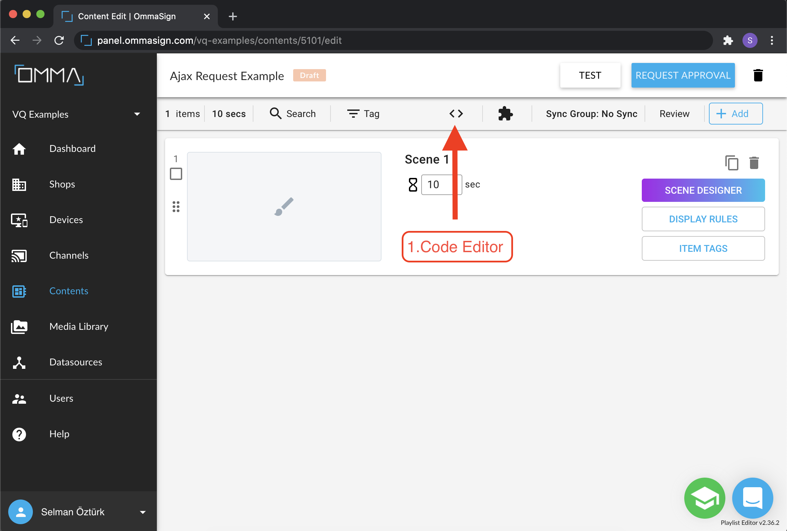
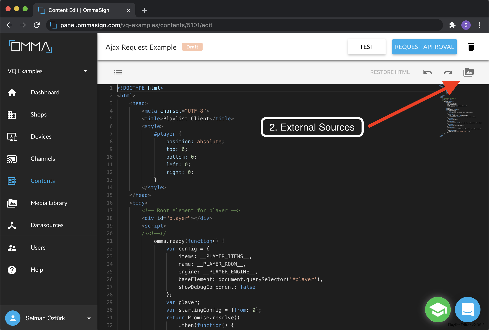

# Runtime Data References 
The personalization of a VQ content boils down to evaluating the decision points and text values on run-time. Every `localVariable` that is referenced on a scene template is replaced by its actual value, utilizing 3 secure methodologies offered by OMMA VQ.
  
Assume that we have a scene contains 3 people and presents their names and images. Use double curly braces for dynamic references like name1, name2, image1, image2 and so on.


## 1. URL Parameters  
The value of a `localVariable` can be set through the iframe URL as a key-value pairs in the query string. VQ-player parses the query-string and populates the `localVariables` dictionary accordingly.


>[Example preview URL is here](https://api.ommasign.com/v1/contents/play/80b6288a382638a2222d45a0730bcfd9718ab7c4c2f15f17e20f2c909af7324f?name1=George&name2=Charles&name3=Josef&image1=https://s3.amazonaws.com/uifaces/faces/twitter/calebogden/128.jpg&image2=https://s3.amazonaws.com/uifaces/faces/twitter/josephstein/128.jpg&image3=https://s3.amazonaws.com/uifaces/faces/twitter/olegpogodaev/128.jpg)

## 2. Ajax Request  
VQ contents can run additional javascript codes on the client device before initializing the VQ-player. Thus, given the appropriate APIs, the user is able to customize the scenario as well as the behavior of the VQ-player. One major implication of this power is filling the localVariables dictionary programmatically during this initialization time.  
VQ player provides an API to the js-code-block for this purpose.
```js
service.helpers.useLocals({ 
        name1: 'George',
        name2: 'Charles',
        name3: 'Josef',
        ...    
})
```

Follow that path to add external source to a content:
> - Code Editor
>
> 

>- External Sources
>
>

>- Add external script
>
>

Keeping in mind that this code-block is going to be run on the client’s device, the value of a `localVariable` can be obtained through an AJAX request to: 
- An external public web-service 
- A password-protected global service 
- A service running on the local network or intranet.  

There are many more use cases of javascript-code-blocks that are solution specific for VQ customers. Overall, OMMA VQ is able to accomplish projects with strict security regulations utilizing the power of its technology. 

A sample script can be found [HERE](./scripts/ajax-request/background-service.js).  

It looks like:


> [Example preview URL is here](https://api.ommasign.com/v1/contents/play/506f989ac14e03d9ec8c3a95a7cfe51ba5f317a488b26588cde3b5d3dd176b4e)

## 3. Post Message API  
This is the most profound method for adding confidential/personal data into the `localVariables` dictionary since all data gathering is handled by the host website itself, assuming that the host has a secure protected environment for the VQ-player. Host websites can communicate with the VQ-player using the `postMessage API`. This communication bus is used for both pushing and pulling data from the VQ-player. For instance, the player can relay user action events to the host. Likewise using the same `postMessage` interface, the host can inject `localVariables` during the initialization process of the player, and it can directly populate the `localVariables` dictionary. 

Here is the steps:  

- Put an iframe element to your container HTML. 
```html
<iframe src="https://api.ommasign.com/v1/contents/play/546da77aaa1479c62ef8f6d5a74e3717339a1c51df7abf18f181feb79b86572f" id="VQ"></iframe>
```

- Pass your data through a postman event.
```js
childIframeEl.contentWindow.postMessage(JSON.stringify({ 
    eventName: 'useLocals', 
    locals: {
        error,
        name1: 'George',
        name2: 'Charles',
        name3: 'Josef',
        ...
    } 
}));
```

- Set the values of your local variables with an external script.
```js
window.addEventListener('message', async event => {
    const data = JSON.parse(event.data);
    
    if (data.locals.error) {
        helpers.raiseError({message: 'Could not get data'});
        return resolve();
    }
    
    if (data.eventName == 'useLocals') {
      const [person1, person2, person3] = data.locals.payload;

      await helpers.useLocals({
        name1: person1.first_name + ' ' + person1.last_name,
        image1: person1.avatar,
        ...
      });
      resolve();
    }
  });
```

Here is the sample [HTML file](./scripts/postman-api/index.html) and [script](./scripts/postman-api/background_service.js).  


