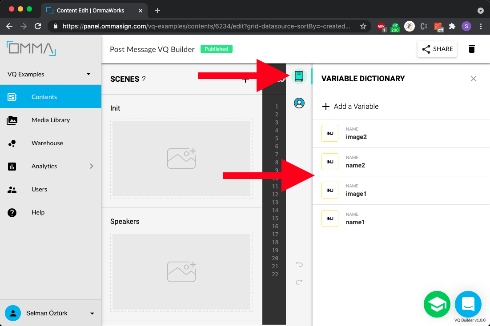

# Native Data Injection with Post Message API 
The personalization of a VQ content boils down to evaluating the decision points and text values on run-time. Every `variable` that is referenced on a scene template can be replaced by its actual value.
  


## Create Your Content  
You can create a simple content using OMMA Panel.
Assume that we have a scene contains 2 people and presents their names and images. Use double curly braces for variables like name1, name2, image1, image2 and so on. Follow the steps below:

1. Create a content and your variables


2. Add scene elements uses those variables


## Android Native Implementation  
There are two main things to run VQ content inside a native WebView:  
- Data flow from javascript side to native side
- Function calls from native side to javascript side.

Here are the steps:
Configure your WebView to allow javascript execution
```java
webView.getSettings().setJavaScriptEnabled(true);
```
To get events initialized from VQ content, we need a javascript bridging interface. It creates an object named `MessagingBridge` under `window` scope.
```java
class MessagingBridge {
    @JavascriptInterface
    public void send(String eventType, JSONObject payload){ ... }
}

...

webView.addJavascriptInterface(new MessagingBridge(), "MessagingBridge");
```  
Proxy events using that messaging bridge
```java
void initMessagingInterface() {
    String eventListenerScript =
            "window.addEventListener('message', function (windowEvent) {" +
            "    const stringifiedData = windowEvent.data;" +
            "    const event = JSON.parse(stringifiedData);" +
            "    if (event.name === 'VQEvent') {" +
            "        const eventName = event.payload.eventName;" +
            "        const payload = event.payload.payload;" +
            "        console.log('sendToNativeFromJs', eventName, payload);" +
            "        window.MessagingBridge.send(eventName, payload);" +
            "    }" +
            "  });";
    webView.evaluateJavascript(eventListenerScript, null);
}
```
Execute it, just after the page started loading
```java
webView.setWebViewClient(new WebViewClient() {
    @Override
    public void onPageStarted(WebView view, String url, Bitmap favicon){
        super.onPageStarted(view, url, favicon);
        initMessagingInterface();
    }
});
```
Now, we are ready to get javascript messages from the native side.

The second part is sending data from native side to javascript side.  VQ has an interface named `postMessage` to communicate. A simple call is like that:  
```javascript
window.postMessage(JSON.stringify({ <your-data> }), '*')
```

Simply we can use a method to execute is from native side.
```java
void postMessage(String context, JSONObject data) {
    String postMessageScript =
            "window.postMessage('"+ data.toString() + "', '" + context + "');";
    webView.evaluateJavascript(postMessageScript, null);
}
```

So, we got a communication line. An example handshake is like:
```java
class MessagingBridge {
    @JavascriptInterface
    public void send(String eventType, JSONObject payload){
        if (eventType.equals("ready_for_data_injection")) {
            postMessage("*", <your-data>);
        }
    }
}
```

There is an example project [here](./android-example).

